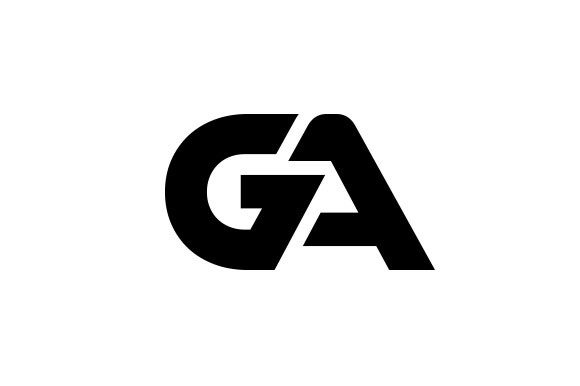

<a name="readme-top">

<br/>

<br />
<div align="center">
  <a href="https://github.com/GodwinAblao">
    
  </a>

  <h3 align="center">Final Project</h3>
</div>

<div align="center">
  A portfolio showcasing my previous projects along with my skills and experience in Web Development, reflecting my ability to create innovative web solutions and achieve successful outcomes.
</div>

<br />


---

<br />
<br />

<!-- TODO: If you want to add more layers for your readme -->
<details>
  <summary>Table of Contents</summary>
  <ol>
    <li>
      <a href="#overview">Overview</a>
      <ol>
        <li>
          <a href="#key-components">Key Components</a>
        </li>
        <li>
          <a href="#technology">Technology</a>
        </li>
      </ol>
    </li>
    <li>
      <a href="#rule,-practices-and-principles">Rules, Practices and Principles</a>
    </li>
    <li>
      <a href="#resources">Resources</a>
    </li>
  </ol>
</details>

---

## Overview


<!-- The following are just sample -->
A portfolio showcasing my previous projects along with my skills and experience in Web Development, reflecting my ability to create innovative web solutions and achieve successful outcomes.

Guiding Question:
- What is the project
  -This project is a personal portfolio website designed to showcase my Web Development skills and past projects. It features a variety of web development components, including interactive elements, dynamic content displays, and a structured layout that highlights my technical expertise. The site includes sections for my resume, project showcases, and a gallery of work, all crafted to demonstrate my proficiency in web technologies.
- Whats the purpose
  -The purpose of this portfolio website is to provide a professional platform where potential clients, employers, or collaborators can explore my skills and past achievements. It serves as a tool to present my technical abilities, share my work experiences, and connect with others in the industry. Through this site, I aim to make a strong impression and open up opportunities for future projects and career growth.

### Key Components
<!-- The following are just sample -->
- MultiPage Website
- Home page
- About Me
- Education
- Previous works
- Contact
- Hover effects
- Resume

### Technology


## Rules, Practices and Principles
1. Always use `WD-` in the front of the Title of the Project for the Subject followed by your custom naming.
2. Do not rename any .html files; always use `index.html` as the filename.
3. Place Files in their respective folders.
4. All file naming are in camel case.
   - Camel case is naming format where there is no white space in separation of each words, the first word is in all lower case while the succeding words first letter are in upper followed by lower cased letters.
   - ex.: buttonAnimatedStyle.css
5. Use only `External CSS`.
6. Renaming of Pages folder names are a must, and relates to what it is doing or data it holding.
7. File Structure to follow below.

```
WD-ProjectName
└─ assets
|   └─ css
|   |   └─ style.css
|   └─ img
|   |   └─ fileWith.jpeg/.jpg/.webp/.png
|   └─ js
|       └─ script.js
└─ pages
|  └─ pageName
|     └─ assets
|     |  └─ css
|     |  |  └─ style.css
|     |  └─ img
|     |  |  └─ fileWith.jpeg/.jpg/.webp/.png
|     |  └─ js
|     |     └─ script.js
|     └─ index.html
└─ index.html
└─ readme.md
```
## Project repositories
Links to my website and project repositories:
- https://github.com/GodwinAblao
- https://github.com/GodwinAblao/WD---godwin1
- https://github.com/GodwinAblao/WD-seatwork2
- https://github.com/GodwinAblao/WD-MIDTERME
- https://github.com/GodwinAblao/WD-seatwork3
- https://github.com/GodwinAblao/WD-HandsOn2
- https://github.com/GodwinAblao/WD-seatwork4
- https://github.com/GodwinAblao/WD-finals


## Resources

<!-- TODO: Add References -->
| Title | Purpose | Link |
|-|-|-|
| Sample Title | Sample purpose would be here like this and this is the example of what it is. | trykolang.com |
